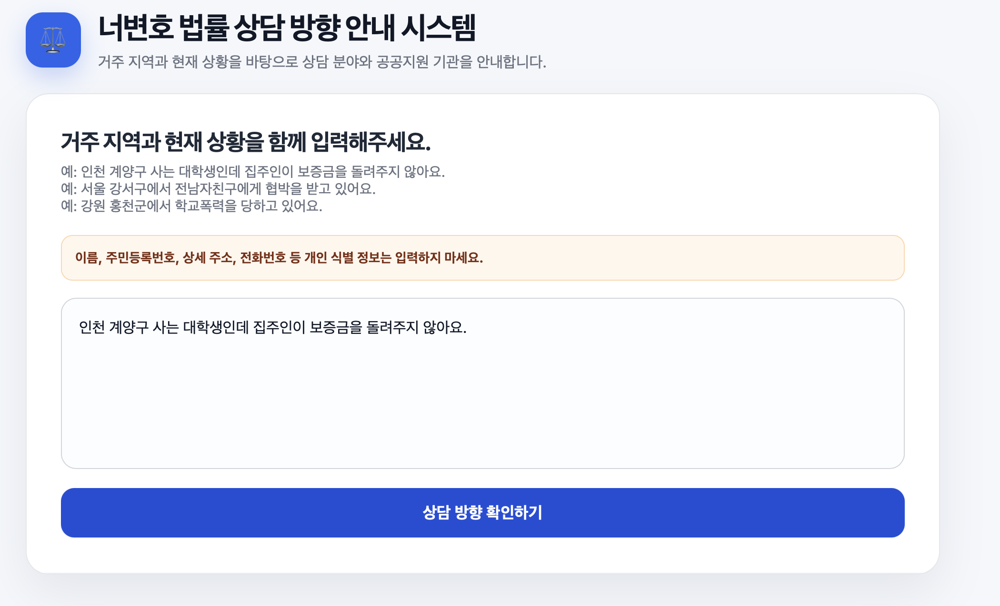
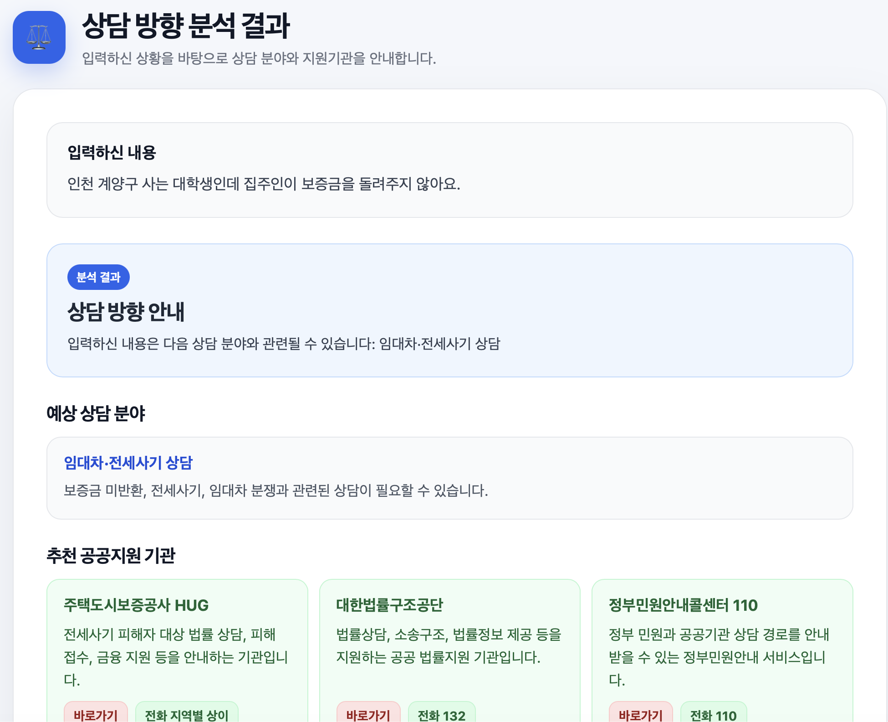
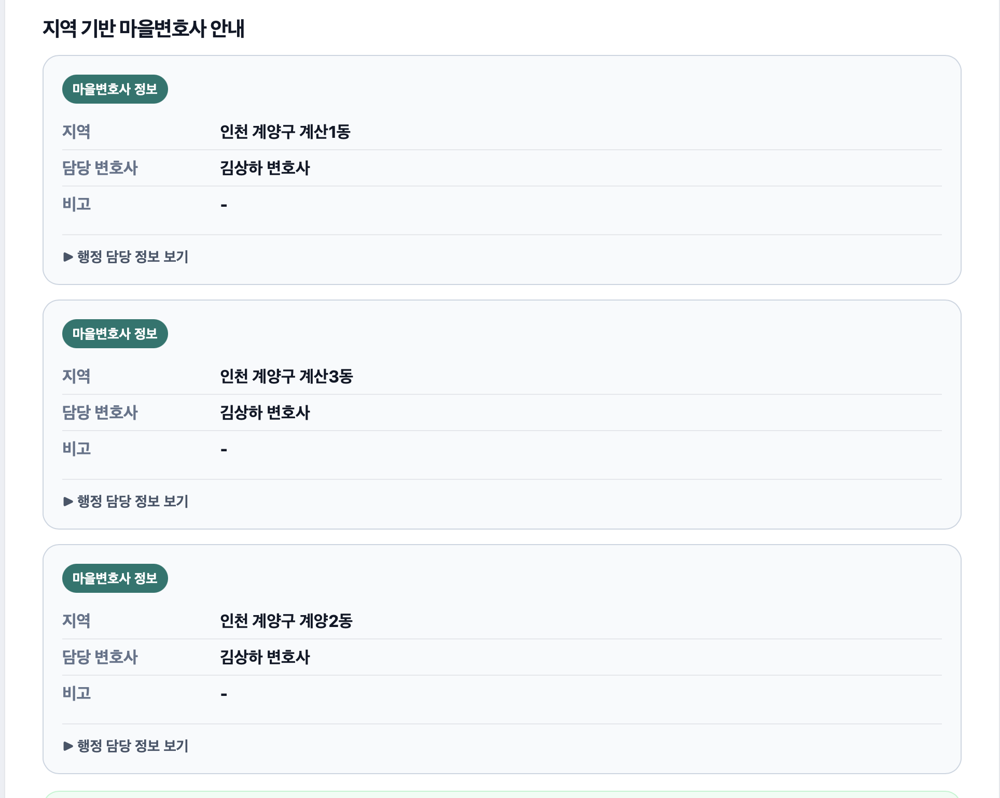
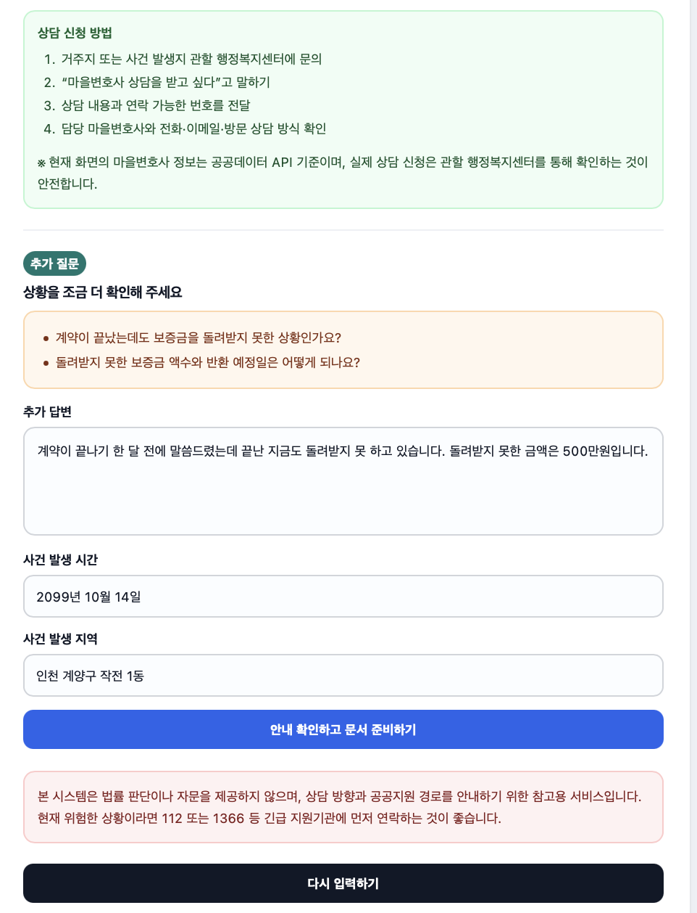
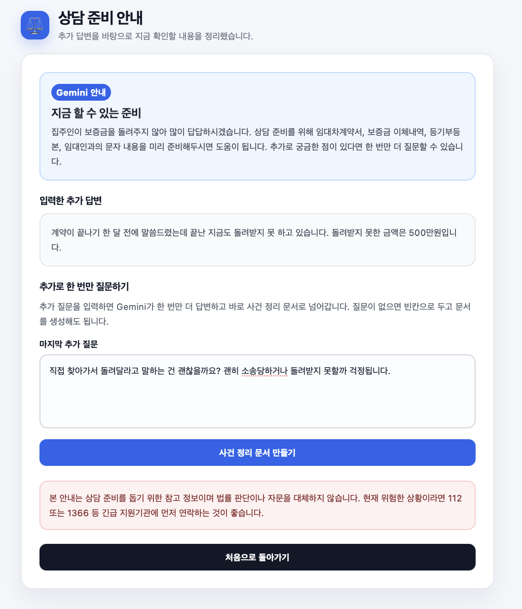
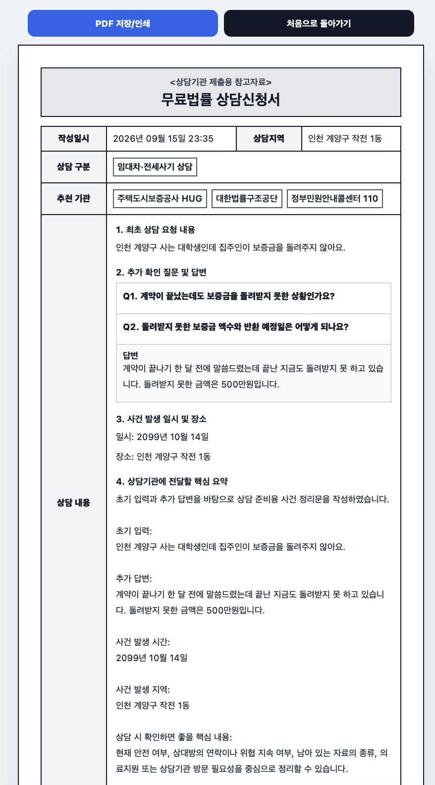
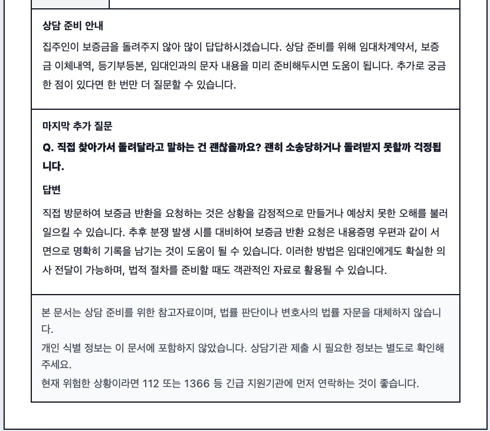

# 너변호 (Justitia)

지방 소도시나 경제적 이유로 법률 도움을 받기 어려운 범죄 피해자가, 자신의 상황을 편하게 입력하는 것만으로 **상담 분야 안내 → 공공지원 기관/마을변호사 연결 → 상담 준비용 문서(PDF)** 까지 받아볼 수 있는 무료 법률 상담 방향 안내 서비스입니다.

법률 자문이나 판단을 대신하지 않으며, "지금 어디에 연락하면 되는지"와 "상담 가기 전에 무엇을 준비하면 좋은지"를 안내하는 데 목적이 있습니다.

## 사용 흐름

> 아래는 실제 동작을 보여주기 위한 예시이며, 날짜(2099년 10월 14일)를 포함해 실제 사건이 아닌 테스트 입력입니다.

1. **상황 입력** (`/`)
   거주 지역 또는 사건 발생 지역과 현재 상황을 자유롭게 입력합니다. 이름, 주민등록번호, 상세 주소, 전화번호 같은 개인 식별 정보는 입력하지 말라는 안내가 함께 표시됩니다.

   > 예시 입력: "인천 계양구 사는 대학생인데 집주인이 보증금을 돌려주지 않아요."

   

2. **분석 결과 확인** (`/result`)
   - 입력 내용을 바탕으로 예상 상담 분야(성폭력, 폭행/상해, 학교폭력, 디지털 성범죄, 임대차·전세사기 등)를 안내합니다. 예시 입력은 "임대차·전세사기 상담"으로 분류되어, 주택도시보증공사 HUG·대한법률구조공단·정부민원안내콜센터 110이 추천됩니다.

     

   - 입력한 지역을 기준으로 공공데이터포털의 **마을변호사** 정보를 조회해 연결 방법을 안내합니다. "인천 계양구"처럼 구·군 단위까지 구체적으로 적으면, 해당 지역에 마을변호사가 배정돼 있을 경우 동(洞)별로 담당 변호사 명단과 상담 신청 방법이 바로 뜹니다. 일치하는 정보가 없으면 지역을 더 구체화해 달라는 안내가 나옵니다.

     

   - 상황을 더 구체화하기 위한 추가 질문 1~2개와, 답변·사건 발생 시간·지역을 입력하는 폼이 함께 제시됩니다.

     

3. **추가 답변 → 상담 준비 안내** (`/guidance`)
   추가 질문에 대한 답변과 사건 발생 시간·지역을 입력하면, 지금 당장 할 수 있는 준비(증거 보존, 의료지원 연계, 긴급 연락처 등)를 Gemini가 짧게 안내합니다. 예시에서는 "임대차계약서, 보증금 이체내역, 등기부등본, 임대인과의 문자 내용을 미리 준비해두라"는 안내를 받았습니다. 마지막으로 궁금한 점을 한 번 더 질문할 수 있는데, 이 단계는 건너뛰고 바로 문서 생성으로 넘어가도 됩니다.

   

4. **사건 정리 문서 생성** (`/case-summary`)
   지금까지의 입력을 바탕으로 상담기관에 들고 갈 수 있는 "무료법률 상담신청서" 형식의 정리 문서를 생성합니다. 작성일시, 상담 구분, 추천 기관, 상담 내용(최초 요청 내용 · 추가 질문/답변 · 사건 발생 일시/장소 · 핵심 요약), 상담 준비 안내, (질문을 입력했다면) 마지막 질문과 답변까지 한 문서에 정리됩니다.

   
   

5. **PDF로 저장** — 문서 화면 상단의 **"PDF 저장/인쇄"** 버튼(위 스크린샷에도 보입니다)을 누르면 브라우저의 인쇄 대화상자가 열립니다. 프린터 대신 **"PDF로 저장"**(또는 "Microsoft Print to PDF", "다른 이름으로 PDF 저장" 등 OS/브라우저별 표기)을 선택하면 이 문서가 PDF 파일로 저장됩니다. 서버에서 별도의 PDF 생성 과정을 거치지 않는, 브라우저 내장 인쇄 기능을 사용하는 방식입니다.

## 사건 분류 방식 (하이브리드)

- 기본적으로 `data/rules.json`에 정의된 키워드 그룹과 점수 규칙으로 사건 유형을 분류합니다.
- `GEMINI_CLASSIFY=true`로 설정하면, Gemini가 사용자 입력의 문맥을 읽고 `rules.json`에 정의된 사건 유형 중에서만 고르도록(JSON 스키마로 강제) 분류를 보정합니다. 키워드만으로는 놓치기 쉬운, 법률 용어가 아닌 일상어 서술도 더 잘 잡아내기 위함입니다.
- Gemini 호출이 비활성화됐거나 실패(쿼터 초과, 네트워크 오류 등)하면 **자동으로 키워드 기반 분류로 폴백**하여 서비스가 끊기지 않습니다.
- 후속 질문 다듬기, 상담 준비 안내문, 사건 요약문 생성에도 Gemini를 보조적으로 사용하며, 각 기능은 개별 환경변수로 켜고 끌 수 있습니다.

## 기술 스택

- **Backend**: Flask (Python)
- **AI**: Google Gemini API (`google-genai`)
- **외부 데이터**: 공공데이터포털 마을변호사 정보 API
- **배포**: Vercel (서버리스, `@vercel/python`)

## 로컬 실행

### macOS / Linux

```bash
python3 -m venv venv
source venv/bin/activate
pip install -r requirements.txt

cp .env.example .env
# .env를 열어 GEMINI_API_KEY, SERVICE_KEY, API_URL 등을 채워주세요.

python app.py
```

### Windows (PowerShell)

```powershell
python -m venv venv
venv\Scripts\activate
pip install -r requirements.txt

copy .env.example .env
# .env를 열어 GEMINI_API_KEY, SERVICE_KEY, API_URL 등을 채워주세요.

python app.py
```

> cmd.exe를 쓴다면 `venv\Scripts\activate` 대신 `venv\Scripts\activate.bat`을 실행하세요.

`http://127.0.0.1:5000` 에서 확인할 수 있습니다.

## 환경변수

| 변수 | 설명 | 기본값 |
|---|---|---|
| `GEMINI_API_KEY` | Google AI Studio에서 발급한 Gemini API 키 | (없음, 미설정 시 전체 Gemini 기능 비활성화되고 키워드 기반으로만 동작) |
| `GEMINI_MODEL` | 사용할 Gemini 모델명 | `gemini-2.5-flash` |
| `GEMINI_CLASSIFY` | Gemini 기반 문맥 분류 사용 여부 | `false` |
| `GEMINI_REFINE_QUESTIONS` | Gemini로 후속 질문 문장을 다듬을지 여부 | `false` |
| `SERVICE_KEY` | 공공데이터포털에서 발급한 서비스키(마을변호사 API) | (필수) |
| `API_URL` | 마을변호사 정보 API 엔드포인트 | (필수) |

## 배포 (Vercel, 무료)

- `vercel.json`이 Python 서버리스 함수(`api/index.py`)와 정적 파일(`static/`)을 함께 빌드하도록 구성돼 있습니다.
- GitHub 저장소와 Vercel 프로젝트가 연동돼 있어 `main` 브랜치에 push하면 자동으로 재배포됩니다.
- 환경변수는 로컬 `.env`가 아니라 Vercel 프로젝트의 Environment Variables 설정에 별도로 등록해야 합니다.

## 개인정보 안전장치

- 사용자의 입력을 저장하는 데이터베이스가 없습니다. 모든 데이터는 요청이 끝나면 서버에 남지 않습니다.
- 입력창에 개인 식별 정보를 넣지 말라는 안내 문구가 표시됩니다.

## 면책

이 서비스는 법률 판단, 죄명 단정, 승소 가능성 판단을 제공하지 않으며 변호사의 법률 자문을 대체하지 않습니다. 현재 위험한 상황이라면 112 또는 1366 등 긴급 지원기관에 먼저 연락하시기 바랍니다.
